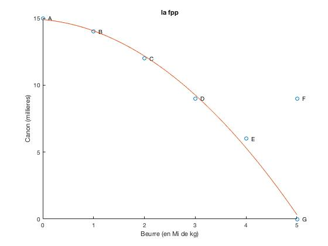
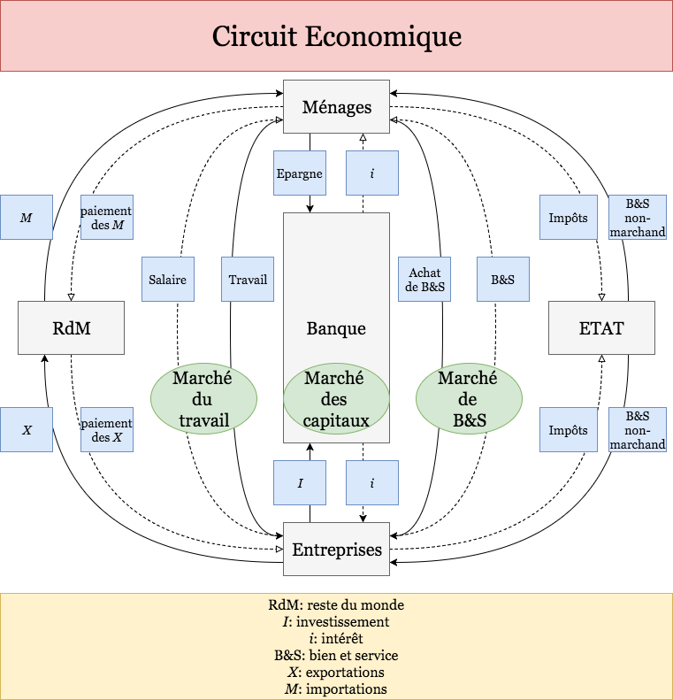

`2017-09-11 Monday`
# Programme sur les 2 ans
Introduction ($\sum\text{termes techniques}$)

1. Microéconomie
2. Macroéconomie
3. Ouverture internationale
4. Économie du développement

# Chapitre 1: Les fondements de l'Economie
## Introduction
L'économie cherche à résoudre les problèmes de satisfaction, des besoins fondamentaux des individus.

## 1. La rareté
La rareté est un concept de base qui sert à mesurer notre capacité à satisfaire nos besoins fondamentaux.

Pour les économistes, tous les biens et services (B&S) qui ont un prix sont relativement (plus ou moins) rares. En effet, les B&S sont rares par rapport à la demande des personnes.  
Ex. des bus, du pétrole ...

Les B&S qui satisfont nos besoins n'existent pas en quantité suffisante c'est-à-dire en quantité rare ou limitée. Notons qu'on parle bien d'une rareté des ressources.

Les économistes utilisent le terme  «rareté» d'une façon différente de celle de l'usage quotidien. Cette notion constitue le postulat de base d'un grand nombre de théories économiques.

La rareté n'est pas une hypothèse mais une réalité universelle et atemporelle: presque tout et rare.

Les bus ne sont pas rares à Paris mais pour les économistes, ils le sont car peu de personnes peuvent acquérir (acheter) un bus.

### Définition
La rareté est une tension entre les besoins et les ressources disponibles pour les satisfaire.

- L'économie est la science de la rareté.
- L'économie étudie la manière dont la société gère ses ressources rares.
- Cette science étudie comment les ressources rares sont utilisées pour satisfaire les besoins des hommes qui vivent en société.

La rareté mesure le caractère limité des ressources de la société.

### Exemple
Venezuela, aujourd'hui (**cadre spatial et cadre temporel**): rareté en terme de nourriture

## 2. Le choix
les économistes tentent de résoudre le problème de rareté en faisant des choix.  
Les personnes n'ont pas des revenus infinis. Ils doivent faire des choix pour acheter des B&S.  
Ils doivent prendre de nombreuses décisions pour bien utiliser leurs ressources limitées.  
En général, pour obtenir un B&S, il faut renoncer à un autre que l'on aime. Prendre une décision revient donc à comparer deux objectifs.  
Ex. 2 T-shirts  
Comme la plupart des individus vivent en société, ils sont confrontés à d'autres types de choix.  

L'exemple traditionnel en Économie oppose le beurre au canon. Plus l'on dépense en Défense Nationale (canon) pour protéger notre territoire, moins il restera à dépenser pour améliorer notre niveau de la vie à l'intérieur (beurre). *(Samuelson)*  
Dans les sociétés contemporaines, un choix devenu vital est celui qui oppose l'environnement propre et niveau de revenu. Ex. les lois qui contraignent les entreprises à réduire leur niveau de pollution génèrent une augmentation des coûts de production des B&S. En effet, les entreprises(e) en question gagnent moins de revenus, payent des salaires inférieurs à leurs employés et augmentent le prix de leurs produits. Finalement, si les lois antipollution nous procurent un environnement plus salubre (sain), elles le font au prix d'une baisse des revenus des propriétaires, des employés et des clients des firmes polluantes.

La société doit souvent choisir entre efficacité et justice.  
Elle se réfère à la taille du gâteau.  
La justice consiste à distribuer équitablement entre les membres de la société les produits de ces ressources. Elle se réfère à la façon de la partager.  
Savoir que l'on doit faire des choix ne nous renseigne pas sur les décisions qui seront ou devront.

## 3. Le coût d'opportunité
Parce que l'on doit faire des choix, prendre une décision implique d'être capable de comparer des coûts et des bénéfices des diverses options possibles.  
Ex. du choix de l'étudiant d'une année supplémentaire à la fac.  

Toute décision induit (suppose) un coût appelé le coût d'opportunité.  
Le _coût d'opportunité_ est le gain maximum que l'on aurait plus obtenir dans le meilleur emploi alternatif possible d'une ressource. Par ex., les revenus que l'ont emploient pour un voyage ne peuvent pas être utilisés pour un placement financier.

### Définition
_Le coût d'opportunité d'un B&S est la quantité d'autres B&S à laquelle il faut renoncer pour produire une unité supplémentaire de ce B&S._  
Le coût d'opportunité est la meilleure alternative prévue d'avance quand une décision économique est prise.  
Classification des B&S en fonction du coût d'opportunité: lorsqu'un B&S a un coût d'opportunité car il est relativement rare, alors il a un prix et il est classé comme un B&S économique. Par contre, lorsqu'un B&S est disponible en abondance et gratuit et dont la production ne nécessite aucun travail humain, alors il est classé comme un B&S libre ou naturel. Ex. l'air est abondant, tout le monde peut en avoir autant qu'il veut.

## 4. Les questions fondamentales
Toute société humaine, que ce soit une nation industrialisée avancée, une économie à planification centrale ou une nation tribale isolée, est inévitablement confrontée à trois problème sou questions fondamentales.  
Toute société doit trouver un moyen de déterminer *quelles* marchandises sont produites, *comment* elles le sont et pour *qui* elles le sont.

### Que produire?
Quelles marchandises sont produites et en quelles quantités? A quel moment la production sera-t-elle mise en œuvre?

La production est l'activité consistant à créer des B&S propres à satisfaire des besoins individuels ou collectifs.

Produire = utiliser conjointement (combiner) des ressources non directement aptes à satisfaire nos besoins en vue d'obtenir des B&S.

La production est la somme de la production marchande et la production non-marchande.  
La production marchande est la production des B&S destinée à être vendue sur un marché.  
La production non-marchande représente les services gratuits ou quasi-gratuits réalisés avec des facteurs de production obtenus sur le marché.

### Comment les B&S sont-ils produits?
Une société (un pays) détermine qui effectuera la production, avec quelles ressources et à l'aide de quelles techniques de production.  
L'électricité est-elle produite à partir du pétrole, du charbon ou du soleil? Les usines fonctionnent-elles avec des hommes ou des robots?

### Pour qui les biens sont-ils produits?
Qui profitera des fruits de l'activité économique? La répartition du revenu et de la richesse est-elle impartiale et équitable? Comment le PIBB est-il partagé entre les différents ménages? Y a-t-il beaucoup de pauvres et quelques riches? A qui vont les revenus élevés? L'université doit-elle être pour tous ou pour ceux qui peuvent payer l'enseignement?

Toute l'activité économique qui permettra de répondre à ces questions est organisée à l'aide de trois opérations: la production, l'échange et la consommation.

## 5. Les facteurs de production
Il y a quatre ressources ou moyens qui permettent à une économie de produire ses produits et donc de répondre à ces trois questions fondamentales.  
Toute société doit faire des choix concernant les moyens de production et les B&S produits pour l'Economie.

### a) La terre (T)
La terre ou ressources naturelles inclut beaucoup d'éléments. Cela comprend tout ce qui est sous la terre comme l'or, le pétrole, le gaz naturel, etc., et tout ce qui est au-dessus de la terre qui est cultivé comme le riz, le blé.

### b) Le travail (L ou W)
Le travail est un facteur humain. Il désigne dans le pays industrialisés (PI) une activité humaine rémunérée qui donne lieu à une contrepartie monétaire ou en nature.  
Les personnes ou actifs mobilisent leurs capacités physiques ou intellectuelles pour obtenir un B&S qui répondent à des besoins déterminés.  
A noter l'importance de l'organisation du travail qui représente la façon dont l'activité est répartie entre les différents salariés de l'entreprise.

	Population (P.) totale
	| - P. inactive
	| - P. active = P.AO + P.AI
	    | - P. A. Occupée
	    | - P. A. Inoccupée = chômeurs
	    

### c) Le capital
Le capital provient de l'investissement(*=achat*) en capital technique et en capital humain.

- Le capital technique est composé des moyens matériels comme les machines, les routes.  
Plus précisément, il y a le stock de biens manufacturés comme les usines et les machines d'une part  
et le stock du pays comme les routes, les chemins de fer, les ports et les aéroports, les communications d'autre part.
- Le capital humain qui représente la valeur de la force du travail comme l'éducation.  
Le capital humain est l'ensemble des capacités intellectuelles et professionnelles d'un individu qui lui assurent des revenus monétaires futurs.  
Cf. Gary Becker, prix Nobel d'Economie, 1992, est à l'origine de cette expression. 

On distingue aussi deux formes de capital: 

- Le capital fixe qui sert plusieurs fois, à plusieurs cycles de production.
- Le capital circulant qui disparaît dès la 1ère utilisation dans le processus de production.

Ex. La production de transport a besoin de capital fixe comme le camion et de capital circulant comme l'essence.

NB: Facteurs complémentaires et substituables

- Facteurs complémentaires: l'usage d'un facteur rend nécessaire l'usage de l'autre
- Facteurs substituables: l'usage de l'un peut être remplacé par l'usage d'un autre facteur. On distingue le facteur à forte intensité capitalistique quand il y a peu de travail et beaucoup de capital du facteur à faible capacité capitalistique quand il y a peu de capital et beaucoup de travail.

Ne pas confondre la _capital technique_ qui incorpore un certain progrès technique (machines récentes) du _capital physique_ qui représente les biens produits dans le passé et qui sont des moyens de la production présente et future (bâtiments, matériel, machines, produits semi-finis, matières premières) et du _capital financier_ qui regroupe les actifs qui rapportent un intérêt.

### d) Le management
C'est l'ensemble des connaissances concernant l'organisation et la gestion d'une entreprise.  
À noter l'importance de l'organisation du travail qui représente la façon dont l'activité est répartie entre les différents salariés de l'entreprise.

	(quantité++ && temps++) OU (quantité-- && temps--) ?

Productivité = efficacité de production = $\frac{Quantité}{temps}$

## 6. Les courbes de possibilité de production
L'ensemble de nos actes quotidiens, notre vie quotidienne dépend des actions de milliers de personnes que nous ne rencontrerons jamais mais qui ont contribué à produire tout ce dont nous jouissons chaque jour.  
L'Economie coordonne les activités de millions de personnes aux goûts et aux talents différents. Il y a donc une interdépendance économique.  
Les économistes pour montrer les concepts de rareté, de choix, de coût d'opportunité utilisent la(es) courbe(s) des possibilités de production appelée(s) plus précisément la frontière des possibilités de production soit la `fpp`.

La `fpp` montre les quantités maximales de production qui peuvent être obtenues par l'économie, compte tenu des connaissances technologiques et de la quantité de moyens de production disponibles. On parle de production potentielle.

La `fpp` exprime l'ensemble des combinaisons de biens et services accessible pour une société donnée.  
Ex. p.6  
Autre exemple celui de Samuelson avec les canons et le beurre.  
Les pays ne disposent pas de moyens illimités des divers produits. Ils sont contraints par les ressources et la technologie disponibles.  

### Tableau des possibilités de production
| Cas | Beurre | Canon |
|-----|--------|-------|
|A    |0       |15     |
|B    |1       |14     |
|C    |2       |12     |
|D    |3       |9      |
|E    |4       |5      |
|F    |5       |9      |
|G    |5       |0      |

- C, D: production sous-maximale
- E, F: situation impossible à moment donné

### Représentations avec la fpp
[illustrations](../fpp.ipynb)

## 7. L'utilité
> Maximisation du bien-être, comportement économique rationnel
Ils cherchent à maximiser leur utilité (càd le degré de satisfaction que leurs procurent leurs achats) compte tenu de leurs ressources et des prix fixés sur le marché.

L'utilité mesure le degré de satisfaction que l'on tire d'un produit.

Cette notion de l'utilité provient de l'Ecole des Marginalistes. L'école se base sur l'utilité marginale pour décrire la valeur économique d'un produit. 

L'utilité mesure la satisfaction des consommateurs et les goûts de préférence entre plusieurs biens. Les ménages ou les consommateurs cherchent à maximiser leur utilité compte tenu de leur ressource (revenu) et des prix fixés par le marché. Ils recherchent à répartir leur budget entre tous les biens et services disponibles. La théorie du consommateur traite de toutes ces décisions prise par le consommateur. Les choix de consommation dépendent de nos besoins des goûts, des prix, des revenus (préférence).

### Définition
L'utilité désigne la satisfaction ou le plaisir retiré par un individu de la consommation d'un B&S.

### Exemple
	\ 1 /   \ 2 /   \ 3 /   \ 4 /   \ 5 /
	U maximale       ...            U minimale

L'utilité marginale mesure la variation de la satisfaction liée à la consommation d'une unité supplémentaire d'un B&S. L'utilité marginale mesure la variation de l'utilité totale pour une variation très petite de la quantité consommée ($U_m$).

Supposons:

- La consommation de 1 café procure une utilité, $U_1$ = 10
- et que celle de 2 cafés procure une utilité, $U_2$ = 15
- ($U_3 = 17$)

L'utilité totale augmente (sinon on ne prendra pas un autre café), mais moins fortement qu'avec le 1^er café. L'utilité marginale correspond au $U_m = U_2 - U_1 = 15 - 10 = 5$

L'intérêt de cette notion d'utilité marginale et du raisonnement "à la marge" est de mettre en évidence la Loi de l'$U_m$ décroissante. L'utilité continue à croître puisque la consommation correspond à une utilité, mais elle augmente de moins en moins vite. 

NB: les prix relatifs = rapport entre les prix de deux biens ou de plusieurs biens

## 8. Microéconomie et macroéconomie
Pour faciliter l'étude de l'économie, on la divise en deux branches. 

La microéconomie étudie une partie de l'économie, la macroéconomie s'intéresse au fonctionnement de l'économie prise dans son ensemble.

La microéconomie étudie les comportements des individus, des consommateurs et des producteurs. Elle s'intéresse à la façon dont les choix des uns et des autres s'ajustent au travers de l'équilibre de la demande et de l'offre sur chaque marché des B&S.

La macroéconomie étudie et cherche des solutions aux grands problèmes économique comme l'inflation, le chômage, la croissance et le développement.

Remarque: même si on distingue les deux sciences, en réalité on peut retrouver le comportement microéconomique dans la macroéconomie.

## 9. Economie positive et économie normative
L'économie combine des considérations normatives et des constatations positives.

**L'économie positive** s'intéresse à l'explication objective ou scientifique du fonctionnement de l'économie.  
**L'économie normative** fournit des recommandations pour améliorer la situation économique: ces avis reposent sur des opinions. Ces opinions normatives peuvent aussi être à la base d'hypothèses simplificatrices nécessaires à la construction de modèles et méthodes.

- Jean: Le salaire minimum légal est une des causes de chômage
    - économie positive / scientifique => descriptif
- Paula: Le gouvernement devrait augmenter le salaire minimum légal
    - économie normative => prescriptif

## 10. Circuit économique
L'activité économique est le résultat d'innombrables opérations effectuées par une multitude d'unités élémentaires telles l'entreprise, les ménages, etc.)  
Comme il est impossible de décrire tous ces mouvements particuliers, on regroupe ces unités élémentaires en grandes catégories (cf. les acteurs économiques) afin de schématiser les opérations économiques réalisées.  
Le circuit économique désigne une façon simplifiée de représenter l'activité économique.  
Il représente donc le fonctionnement d'une économie sous la forme de flux orientés reliant des agents économiques (entreprises, ménages, Etat etc.), des marchés (marché du travail) ou des opérations  (consommation, production, etc.)  
François Quesnay fut un des premiers à utiliser cette approche avec son «Tableau économique» en 1758.  
Cf. les représentations p.9 et en cours

## 11. Système de rationnement: économique planifiée à l'opposé de l'économie du marché libre
Le rationnement désigne une situation de marché dans laquelle les prix ne peuvent pas se fixer librement par le jeu de l’offre et de la demande, ce qui conduit à une limitation soit de la quantité offerte soit de la quantité demandée des b&s.

(L'Etat décide sur les 3 questions fondamentales: que produire, comment produire, pour qui produire)

### a) Economie planifiée
C’est une économie où des agents économiques(=Etat) mettent en place un processus consistant à fixer les prix, pour un horizon de moyen terme (entre 3 et 5 ans) des grandeurs économiques et des mutations ou changements qualitative associées à l’évolution de ces grandeurs (modifications de la structure de consommation, de production ...).
On oppose planification impérative comme celle soviétique de la planification indicative comme en France (elle est née dans un contexte de pénurie).
Dans la planification impérative, les objectifs s’opposent aux agents économiques tout particulièrement aux entreprises qui sont tenues d’appliquer les objectifs fixés par le Plan.

### b) Economie du marché libre
#### Définition
_Système économique qui accorde un rôle central aux mécanismes de marché pour assurer a régulation des activités techniques économiques._

#### Exemple
Les économies occidentales

L’économie est alors considérée comme un ensemble de marchés assurant automatiquement l’équilibre entre les offres et les demandes de b&s économiques.  
Cette représentation de l’économie est appelée libérale car la régulation ne doit pas être perturbée par les interventions de l’Etat.

## 12. La croissance économique (Cr)
La croissance (Cr) désigne l’augmentation _durable_(=long terme / 10+ années) de la production d’une économie.

C’est un phénomène quantitatif que l’on peut mesurer par le taux de Cr. du PIB càd le taux du produit intérieur brut. Il est donné en monnaie constante ou en volume ou en réel.  
La Cr. réelle est la hausse du PIB après avoir éliminé la hausse due à l’inflation (I°) en %.  

> Variable économique (ex. **PIB**)
>
>  - avec inflation
>      - prix courant
>      - en valeur
>      - en normal
>  - sans inflation
>      - prix constant
>      - en volume
>      - en réel

Ex. En 2017 (e), le taux de Cr des pays avancés s’élève à 1,6%, celui de la zone euro à 1,7%, et celui des pays émergeants et en développement à 4,2%.

Écart entre taux de Cr. de la zone euro et celui des pays émergeants: 

    4.2% - 1.7% = 2.5 POINTS de %

A ne pas confondre avec l’expansion qui est aussi une hausse de la production d’un pays mais de courte durée soit une année.

A ne pas confondre aussi Cr. et développement. En effet, ces termes sont proches mais distincts.  
Cf. la section 2

## 13. Le développement économique (Dt)
Selon la définition de François Perroux, le développement est:

- une combinaison de changements mentaux et sociaux
- aptes à faire croître 
- cumulativement et durablement (une génération = 20 ans)
- le produit réel global.

C’est un phénomène qualitatif.  
Il est mesuré par l’indice de développement humain, IDH.  
Cf. la section 4

## 14. Le développement durable
Le Dvt durable est un nouveau mode de développement (Dvt) officiellement proposé comme objectif à leur état-membre par la CNUCED (Conférence des Nations unies sur l’environnement et le Dvt) et la Banque mondiale par le rapport de la commission Brundtland.

Il y a une volonté de concilier le bien-être des générations présentes avec la sauvegarde de l’environnement pour les générations futures.

### Définition
Le développement durable est une forme de développement qui répond aux besoins du présent (des générations actuelles) sans compromettre la capacité de répondre aux besoins des générations futures.

Auteurs :

- Adam SMITH (1723-1790)
- Karl MARX (1818-1883)
- Dr.Gro BRUNDTLAND (1939-..)

## Complément: STOCK et FLUX
### Définition
- Le `stock` désigne une ou des grandeurs disponibles à un moment donné
- Le `flux` désigne un mouvement de grandeur qui est transporté pendant une période

### Exemple
Avec 1 entreprise:

- capital technique: **S**
- investissement: **F**

### Schéma
      =||=
    --------\         - flux (Investissement)
    ------\ |
          | |
           *
           
           *

     \**************/
      \************/  - stock
       \__________ *|
                  |*| - capital, usage
                  |*|
                  \__
                  

